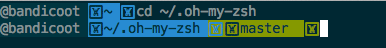

> _This wiki is automatically published from [ohmyzsh/wiki](https://github.com/ohmyzsh/wiki). To edit this page,_
> _go to [ohmyzsh/wiki](https://github.com/ohmyzsh/wiki), make your changes and submit a Pull Request._

_If you don't find what you're looking for, and you think it should be covered by the FAQ, please [open a new issue](https://github.com/ohmyzsh/ohmyzsh/issues/new?title=FAQ:%20) with what you think should be here._

<!-- TOC depthfrom:2 -->

- [Definitions](#definitions)
    - [What is Oh My Zsh and what does it have to do with zsh?](#what-is-oh-my-zsh-and-what-does-it-have-to-do-with-zsh)
    - [What is a zsh plugin?](#what-is-a-zsh-plugin)
    - [What is a zsh theme?](#what-is-a-zsh-theme)
    - [What is the .zshrc file?](#what-is-the-zshrc-file)
    - [What Oh My Zsh is not](#what-oh-my-zsh-is-not)
    - [What Zsh is not](#what-zsh-is-not)
- [How do I...?](#how-do-i)
    - [How do I install Zsh?](#how-do-i-install-zsh)
      - [How do I install Zsh on Windows?](#how-do-i-install-zsh-on-windows)
    - [How do I install Oh My Zsh?](#how-do-i-install-oh-my-zsh)
      - [How do I install Oh My Zsh globally?](#how-do-i-install-oh-my-zsh-globally)
    - [How do I update Oh My Zsh?](#how-do-i-update-oh-my-zsh)
    - [How do I manually update Oh My Zsh from a script?](#how-do-i-manually-update-oh-my-zsh-from-a-script)
    - [How do I uninstall Oh My Zsh?](#how-do-i-uninstall-oh-my-zsh)
    - [How do I change my locale?](#how-do-i-change-my-locale)
    - [How do I reload the zshrc file?](#how-do-i-reload-the-zshrc-file)
    - [How do I reset the completion cache?](#how-do-i-reset-the-completion-cache)
- [Common problems](#common-problems)
  - [Installation](#installation)
    - [I can't access the installer / connection timed out](#i-cant-access-the-installer--connection-timed-out)
    - [My .zshrc file was deleted on install](#my-zshrc-file-was-deleted-on-install)
    - [I can't check out a specific commit in the Oh My Zsh folder](#i-cant-check-out-a-specific-commit-in-the-oh-my-zsh-folder)
  - [Font issues](#font-issues)
    - [I have a weird character in my prompt](#i-have-a-weird-character-in-my-prompt)
  - [Completion issues](#completion-issues)
    - [I have enabled a completion plugin but the completion doesn't work](#i-have-enabled-a-completion-plugin-but-the-completion-doesnt-work)
    - [I see duplicate typed characters after I complete a command](#i-see-duplicate-typed-characters-after-i-complete-a-command)
    - [Completions are not loaded when using a plugin manager](#completions-are-not-loaded-when-using-a-plugin-manager)
  - [Zsh errors](#zsh-errors)
    - [zsh: no matches found](#zsh-no-matches-found)
    - [Some commands no longer work after installing Oh My Zsh](#some-commands-no-longer-work-after-installing-oh-my-zsh)
- [Other problems](#other-problems)
    - [`kill-word` or `backward-kill-word` do / don't delete a symbol (`WORDCHARS`)](#kill-word-or-backward-kill-word-do--dont-delete-a-symbol-wordchars)
- [Why is `PUSHD_IGNORE_DUPS` set by default?](#why-is-pushd_ignore_dups-set-by-default)
- [Why shouldn't I install Oh My Zsh as root?](#why-shouldnt-i-install-oh-my-zsh-as-root)

<!-- /TOC -->

## Definitions

#### What is Oh My Zsh and what does it have to do with zsh?

Zsh is a [shell](https://en.wikipedia.org/wiki/Shell_(computing)), just like [bash](https://www.gnu.org/software/bash/) or [fish](https://fishshell.com/), which interprets commands and runs them. Oh My Zsh is a framework built on top of zsh that is structured to allow it to have plugins and themes, as well as providing what we think are the best settings from the start. You can use zsh without Oh My Zsh, but you can't use Oh My Zsh if you don't have zsh.

#### What is a zsh plugin?

A zsh plugin is, on its most basic form, just a shell script that can be interpreted by Zsh. So, in its essence, it can do anything that you could do run line by line in your terminal. A plugin can also provide completion for certain commands and functions.

#### What is a zsh theme?

A zsh theme is a zsh script that changes the **prompt**. The prompt is the line (or lines, on multiline themes) that appear every time you want to run a command. This is ultimately accomplished by changing the `$PROMPT` variable. But a theme can do much more than that, like adding an automatic git status prompt that changes each time the prompt is redrawn, or a clock that is refreshed per-second, or many other functionalities like that. Browse the [[Themes]] page to find one that you like.

**NOTE: a zsh theme can't change the appearance of your terminal emulator**. This includes things like the color scheme or the character font. Those are separate settings that need to be configured in your terminal emulator settings.

#### What is the .zshrc file?

The `.zshrc` file (or just `zshrc` file) is a file that zsh reads when it starts. It can be found in your home directory, which will change depending on the system and platform you're using. On a terminal, the path to the home directory can be found by running `echo $HOME`.

#### What Oh My Zsh is not

- Zsh
- A Zsh replacement
- A plugin/theme downloader (although a lot of plugins/themes are preinstalled)
- The app that's called "Terminal"
- A terminal shell
- A Zsh theme
- A Bash theme
- A dead project

#### What Zsh is not

- Oh My Zsh
- A plugin engine
- A reason to instantly uninstall Bash
- Unusable without Oh My Zsh
- The app that's called "Terminal"

## How do I...?

#### How do I install Zsh?

Check first that you have it installed: run `zsh`. If you really don't have it installed, please see [[Installing Zsh]] for instructions on how to install it on multiple systems.

##### How do I install Zsh on Windows?

You can't install Zsh directly on Windows. As a reminder, Oh My Zsh needs Zsh installed to work - if you can't install Zsh, you can't install Oh My Zsh.

To use Zsh on Windows, you need Windows 10 2004 or 11, and one of the following:

- [Cygwin](https://github.com/ohmyzsh/ohmyzsh/wiki/Installing-ZSH#cygwin)
- [WSL](https://github.com/ohmyzsh/ohmyzsh/wiki/Installing-ZSH#ubuntu-debian--derivatives-windows-10-wsl--native-linux-kernel-with-windows-10-build-1903) (note that this requires you to first [install WSL](https://docs.microsoft.com/en-us/windows/wsl/install))

If you're running earlier versions of Windows, you can't install it at all. You'll need a virtual machine, or a proper Linux install.

#### How do I install Oh My Zsh?

Please follow the project's README instructions for a [basic installation](https://github.com/ohmyzsh/ohmyzsh#basic-installation), or the [advanced instructions](https://github.com/ohmyzsh/ohmyzsh#advanced-installation) if you need to automate the installation or change some of the settings of the installer.

If you'd like to install Oh My Zsh for all the users in a system, you can read the next section.

##### How do I install Oh My Zsh globally?

Requirements for a global install:

1. The root of the folder needs to be installed somewhere globally accessible, like  `/usr/share/ohmyzsh` or `/opt/ohmyzsh`, with root ownership without global write permissions.

2. Every user's `.zshrc` file needs to reference the global `$ZSH` installation, and add the settings there, see more below.

3. Automatic updates are already skipped if there's no write access to the global directory or it's not a git repository, so it is not needed to turn it off manually in every `.zshrc` file.
   Remember that the global installation will not be updated automatically. **If you have installed it as a git repository**, you can trigger a manual update by running the command below as the root user:
   ```sh
   zsh /usr/share/ohmyzsh/tools/upgrade.sh  # or wherever you installed Oh My Zsh
   ```

4. `ZSH_CACHE_DIR` is needed for normal usage. This is automatically changed from `$ZSH/cache` to `$HOME/.cache/oh-my-zsh` if `$ZSH/cache` is not writable, so it is not needed to manually change it in every `.zshrc` file.

5. `ZSH_CUSTOM` is set as `$ZSH/custom` and this one is not changed. If the user wants to add custom files they should redefine it to a directory they have write access to.

A reference of the minimal `.zshrc` file is below:

```sh
export ZSH="/usr/share/ohmyzsh"
ZSH_THEME=...
plugins=(...)
source "$ZSH/oh-my-zsh.sh"
```

#### How do I update Oh My Zsh?

Oh My Zsh automatically updates itself if left at the default settings. You can check out [[Settings]] for more information on how to change the update settings.

If you want to manually update Oh My Zsh, you have 2 options:

- If running within your shell, you can use the CLI tool `omz` to force an update and restart the shell session:

  ```sh
  omz update
  ```

- If you want to update Oh My Zsh as part of an automated script, its better to use the `upgrade.sh` script directly. You can call it with any of these alternatives:

  ```sh
  # $ZSH needs to be defined within the automated script you created
  "$ZSH/tools/upgrade.sh"
  zsh "$ZSH/tools/upgrade.sh"
  /path/to/ohmyzsh/tools/upgrade.sh
  ```

  This script also allows you to pass in 2 separate flags to control its behavior:

  - `-i`: tells the script to upgrade interactively. In this mode, the only change is that the changelog will be displayed after the update.
  - `-v default|minimal|silent`: control the verbosity of the script. This is equivalent to the [verbosity](https://github.com/ohmyzsh/ohmyzsh/wiki/Settings#omzupdate-verbosity) settings.

> [!IMPORTANT]
> To upgrade Oh My Zsh, you need to have `git` installed and it needs to be installed as a git repository.  
> It is also required to be running with a user that has write access to the Oh My Zsh installation directory.

#### How do I manually update Oh My Zsh from a script?

See [the section above](#how-do-i-update-oh-my-zsh).

#### How do I uninstall Oh My Zsh?

To remove Oh My Zsh, run `uninstall_oh_my_zsh`. The uninstaller will:

1. Delete the Oh My Zsh folder.

2. Back up your current `.zshrc` file to something like `.zshrc.omz-uninstalled-<date>`. This is so you can recover any settings you might have written in there. If you haven't, you can safely delete it afterwards.

3. If you had a `.zshrc` file previously to installing Oh My Zsh, the uninstaller will restore it back as the new `.zshrc` file.

4. It will attempt to switch back to the default shell you had before installing Oh My Zsh. This will be done by reading the file `~/.shell.pre-oh-my-zsh` which should have been created by the installer; otherwise, it will use `/bin/bash` as the new default shell.

Alternatively, to manually remove OMZ do `rm -rf $ZSH` — you will also have to edit your `.zshrc` file. To manually set a new default shell, do `chsh -s /my/new/shell`, _e.g._ `chsh -s /bin/bash`. Then simply reopen your shells.

#### How do I change my locale?

The `locale` is used in a shell environment to define which language and character encoding (i.e. UTF-8) to use. This will change the language used by commands, as well as the encoding of the characters. Usually, you'll have set the language to use in the settings of your particular system. But sometimes you need to change the encoding used in the shell, most frequently to set it to use UTF-8.

First, to verify what locale you're using, run `locale`. You'll get something like this:

```zsh
$ locale
LANG=en_US.utf8
LANGUAGE=
LC_CTYPE=en_US.utf8
LC_NUMERIC="en_US.utf8"
LC_TIME="en_US.utf8"
LC_COLLATE="en_US.utf8"
LC_MONETARY="en_US.utf8"
LC_MESSAGES="en_US.utf8"
LC_PAPER="en_US.utf8"
LC_NAME="en_US.utf8"
LC_ADDRESS="en_US.utf8"
LC_TELEPHONE="en_US.utf8"
LC_MEASUREMENT="en_US.utf8"
LC_IDENTIFICATION="en_US.utf8"
LC_ALL=
```

These are environment variables that each change one particular part of the messages that commands print. For example, `LC_COLLATE` changes the order in which strings are sorted. But you don't need to know them. We're only interested in `LANG` and `LC_ALL`.

`LC_ALL` defines the locale for all the rest of the locale environment variables. If it's not set, then `LANG` takes precedence. In the case above, it is set to use the `English (United States)` language, and a `UTF-8` encoding.

If we need to change these, we need to see what available locales are installed, and we do that by running `locale -a` (locales ending in `.UTF-8` or `.utf8` all use UTF-8 as their encoding):

```zsh
$ locale -a
C
C.UTF-8
en_US.utf8
POSIX
```

Once we have selected a suitable locale (tip: always use a UTF-8 locale), we can set it in our zshrc file, preferably at the top:

```zsh
export LANG=en_US.utf8
```

#### How do I reload the zshrc file?

You may have seen somewhere that when you make a change to your zshrc file, you need to reload it. The common **wrong** suggestion is to use "source ~/.zshrc". This may cause trouble because some things that are already in the zsh session haven't been removed (variables, functions, hooks...). It's also possible that you're repeatedly running an init script and causing more and more processes to start.

To properly reload the zshrc file, you need to restart the zsh session. You can either:

- Restart the terminal.

or

- Restart the zsh process by running: `exec zsh`.

#### How do I reset the completion cache?

The completion cache file (also known as zcompdump file) is a cache of the completion functions found when starting the zsh session. This file is written when calling `compinit`, and it is done automatically by Oh My Zsh when starting. It can be found at `$ZSH_COMPDUMP`, usually in your home directory and named `.zcompdump-<host>-<zsh-version>`.

**If there is already a file at that location, `compinit` will read it, instead of recreating it, for better performance.** This causes problems sometimes when some completion settings are changed but the completion cache wasn't, like when a plugin is enabled. That's why most completion problems are solved by resetting the cache and restarting the zsh session.

To reset it, you have to delete it and restart your zsh session so that it is recreated again:

```zsh
# Delete the completion cache
rm "$ZSH_COMPDUMP"
# Restart the zsh session
exec zsh
```

## Common problems

### Installation

#### I can't access the installer / connection timed out

Some countries such as India and China block access to `raw.githubusercontent.com`, which is where the installer is hosted.

If you can't access it, you can use our mirror at `install.ohmyz.sh` instead. Using it is as simple as replacing the URL:

```sh
# instead of this URL
sh -c "$(curl -fsSL https://raw.githubusercontent.com/ohmyzsh/ohmyzsh/master/tools/install.sh)"
# use this URL
sh -c "$(curl -fsSL https://install.ohmyz.sh)"
```

The same applies for the other installation methods, which are documented in [the README](https://github.com/ohmyzsh/ohmyzsh#basic-installation)
or in the [[Home]] page.

You might need this if you see any of these errors when running the install command:

```console
failed: Connection timed out.
curl(7): Failed to connect to raw.githubusercontent.com port 443: Connection timed out
curl(28): Failed to connect to raw.githubusercontent.com port 443 after <time> ms: Connection timed out
```

Similar issues:
[#11720](https://github.com/ohmyzsh/ohmyzsh/issues/11720)
[#11818](https://github.com/ohmyzsh/ohmyzsh/issues/11818)
[#11908](https://github.com/ohmyzsh/ohmyzsh/discussions/11908)


#### My .zshrc file was deleted on install

The installer script is designed to back up your existing `.zshrc` file, and any previous backups are also preserved.
This is the current behavior of the installer, so you can search for the backup file and restore it manually.

> NOTE: `~` is the path to the home directory.

a. If a `.zshrc` file is not found, write and modify the template zshrc file to `~/.zshrc`.

b. If otherwise the `.zshrc` exists, start the back up process:

   1. If `~/.zshrc.pre-oh-my-zsh` exists, back it up to `~/.zshrc.pre-oh-my-zsh-<current-datetime>`, where `<current-datetime>` is in the format `YYYY-mm-dd_HH-MM-SS`. **If this destination file exists, the installer is aborted**.
   2. After `~/.zshrc.pre-oh-my-zsh` is backed up, back up the existing `.zshrc` file to `~/.zshrc.pre-oh-my-zsh`.
   3. **Only then write the template zshrc file to `~/.zshrc`.**

As you can see, the installer is designed to never delete any existing files, even if the installer is ran multiple times.
If you find that your `.zshrc` file was deleted, you can search for the backup file with the command below:

```sh
ls -l ~/.zshrc*
```

#### I can't check out a specific commit in the Oh My Zsh folder

This happens because Oh My Zsh installs itself as a shallow git repository, with parameter `--depth=1`, which only pulls the latest commit. This is done to reduce the amount of data downloaded, as the repository is quite large, and also to speed up the installation process. Most users don't need the full history of the repository, so this is a good trade-off.

If you need to check out a specific commit, you can convert the repository to a full one by running the following commands:

```zsh
cd $ZSH
git fetch --unshallow
```

### Font issues

#### I have a weird character in my prompt

It might look like this in iTerm2:



Some themes like Agnoster require a special font to render certain characters. First, make sure you have read the theme's instructions written in the [[Themes]] section. Most of the time this issue is solved by installing a [Powerline font](https://github.com/powerline/fonts), or [a nerd font](https://github.com/ryanoasis/nerd-fonts). Some themes may require the use of a nerd font over a powerline font, but nerd fonts do work wherever powerline fonts work.

After installing it, you need to enable the font in the settings of your terminal emulator. Just installing the font isn't enough, as the terminal doesn't know to use that font for the symbols. Also note that the font has to be set anywhere you display the themes - this may include editors and IDEs.

### Completion issues

Most completion issues are due to an old completion cache file (also called zcompdump file). Before attempting anything else, try to reset it following [the instructions above](#how-do-i-reset-the-completion-cache). If that doesn't make the completion work, look at the other completion issue sections.

#### I have enabled a completion plugin but the completion doesn't work

> **NOTE: a recent update checks whether the plugin list has changed (more accurately, `$fpath`) and resets the zcompdump file, so the solution below isn't needed anymore. If you don't have that yet, update Oh My Zsh with `omz update`.**

As of right now, after enabling or disabling a plugin that provides completion, you have to reset the cached completion file. Follow [the instructions above to delete the completion file](#how-do-i-reset-the-completion-cache).

If this doesn't solve the problem, you might have found a bug in the plugin. Search for issues with the plugin in question, and if there isn't one already (open or closed), open a new bug report.

#### I see duplicate typed characters after I complete a command

This usually happens because your theme uses UTF-8 characters but your `locale` is not set up to handle them. Make sure that you're running a `locale` ending in `.UTF-8` or `.utf8`. See [How do I change my locale](#how-do-i-change-my-locale) for instructions.

Similar issues: [#6985](https://github.com/ohmyzsh/ohmyzsh/issues/6985#issuecomment-412055789), [#3932](https://github.com/ohmyzsh/ohmyzsh/pull/3932), [#4529](https://github.com/ohmyzsh/ohmyzsh/issues/4529), [#4632](https://github.com/ohmyzsh/ohmyzsh/issues/4632).

#### Completions are not loaded when using a plugin manager

Some of the plugins in Oh My Zsh generate completion files dynamically, and puts them in the cache directory under `$ZSH_CACHE_DIR/completions`.

Oh My Zsh already sets this up for you, as part of the [init script](https://github.com/ohmyzsh/ohmyzsh/blob/master/oh-my-zsh.sh). However, plugin
managers don't run this script automatically as they do some internal optimizations.

To check that you are affected by this, try:

```zsh
echo $ZSH_CACHE_DIR
```

It should return something like `/path/to/oh-my-zsh-folder/cache` or `$HOME/.cache/oh-my-zsh`.  
If not, add `ZSH_CACHE_DIR="$HOME/.cache/oh-my-zsh"` in your .zshrc file, before the plugin manager code.

Then, also check that the directories exist:

```zsh
ls -l "$ZSH_CACHE_DIR"
ls -l "$ZSH_CACHE_DIR/completions"
```

If they don't exist, run `mkdir -p $ZSH_CACHE_DIR/completions` once, or add it in the zshrc file after defining `ZSH_CACHE_DIR`.

> [!NOTE]
> This is a workaround when using plugin managers. Ideally we want to make this so that it works out of the box with any plugin manager you use. If you encounter an issue related to this, please +1 Feature Request [#12583](https://github.com/ohmyzsh/ohmyzsh/issues/12583) and add a comment with the plugin manager affected if not already in the list.

### Zsh errors

#### zsh: no matches found

This error happens when you used a wildcard character (also called [glob operators](https://zsh.sourceforge.net/Doc/Release/Expansion.html#Glob-Operators) or globbing characters), which indicate to the zsh interpreter to look for files matching that wildcard pattern (see [Filename generation](https://zsh.sourceforge.net/Doc/Release/Expansion.html#Filename-Generation) for the full documentation). The most common examples of these are `*` (star) and `?` (question mark), when used in anything from `apt`, `git` or even `curl` commands (`?` is usually part of a URL).

There are many solutions, some temporary, some permanent:

1. Temporary: wrap the arguments containing wildcards in **quotes** (double quotes or single quotes, both are OK). For example:

   ```zsh
   $ apt install linux-*
   zsh: no matches found: linux-*
   $ apt install 'linux-*'
   # the command continues successfully
   ```

2. Temporary: prepend **`noglob`** to the command, such that any wildcards will be ignored.

   ```zsh
   $ noglob apt install linux-*
   # has the same effect as
   $ apt install 'linux-*'
   ```

3. Permanent: disable globbing (_aka_ wildcard expansion) at all, using **[`unsetopt glob`](https://zsh.sourceforge.net/Doc/Release/Options.html#index-GLOB)**.
   Put it somewhere in your zshrc file **after** Oh My Zsh is sourced so that it's applied on every zsh session.
   NOTE: this will mean that you won't be able to use wildcards anywhere in your zsh session.

   ```zsh
   $ unsetopt glob
   $ ls -d .* #
   ls: cannot access '.*': No such file or directory
   ```

4. Permanent: another option is using the solution in (2) but making it stick with **an alias** so that you don't need to do this every time you run that particular command. This is much more fine-grained than (3) because you can still use wildcards in other commands.

   ```zsh
   $ alias apt='noglob apt'
   $ apt install linux-*
   # the command continues successfully
   ```

#### Some commands no longer work after installing Oh My Zsh

If you installed software from outside the default system package manager, and therefore made changes to the `PATH` variable to be able to use them, you need to re-add those PATH changes to `~/.zshrc` to get the commands to work. This is required as the PATH variable determines where the shell looks for binaries, and without the changes from your previous shell(s), it can't find the commands. The software this affects includes, but is not limited to, nvm, rustup, Anaconda, and many others. If it works in bash, or worked before you installed Oh My Zsh, it's probably a path issue.

This might result in errors such as this:

```
zsh: command not found: npm
```

This applies even if you were using zsh, and not some other shell, prior to installing Oh My Zsh, as your original zshrc is not modified; it's replaced, but backed up before it's installed. If you used zsh prior to installing Oh My Zsh, you can retrieve your old zshrc from `~/.zshrc.pre-oh-my-zsh`, and copy the changes you made from there. 

If you weren't using zsh before, you need to copy over any changes to the PATH from the config file for your previous shell. Note that certain programs, such as Anaconda, may have initialisation functions that are shell-dependent, and that cannot be copied directly. For these, it's recommended you try to re-initialise the config using the software's own installation/initialisation system. For example, for Anaconda, you can use `conda init zsh` to regenerate the initialisation block correctly. See the documentation for the specific software you're using for more details about your alternatives when changing shells. 

However, in most cases, it's enough to look at your old config files, find any and all `export PATH="some string here"` (where "some string here" is a placeholder for actual PATH changes), and copy those back into your current `.zshrc`. 

## Other problems

#### `kill-word` or `backward-kill-word` do / don't delete a symbol (`WORDCHARS`)

**History:**

Since the beginning of Oh My Zsh and up until commit [50dc4ab](https://github.com/ohmyzsh/ohmyzsh/commit/50dc4ab3574f4e265dff816d8d9a0195cd260152) (Sept. 4, 2020), the framework set `WORDCHARS` to empty string. Afterwards, **`WORDCHARS` was set to `_-`**. Days after that, [there was ample support](https://github.com/ohmyzsh/ohmyzsh/issues/9367) for going back to the previous behavior, so commit [3f42700c](https://github.com/ohmyzsh/ohmyzsh/commit/3f42700c0d65cf26470d1e165b8ed80dfff9efca) reverted the change.

**What does this do?**

[This variable tells zsh which non-alphanumeric characters are part of a **word**](https://zsh.sourceforge.net/Doc/Release/Parameters.html#index-WORDCHARS). This means that any characters in this string will be included in what constitutes a word. If `WORDCHARS` is `''`, that means that only alphanumeric characters are part of a word. Let these examples explain it better (the `|` represents the cursor):

```console
$ command arg1 arg2-with_symbols|
```

Let's imagine we press <kbd>CTRL</kbd>-<kbd>Backspace</kbd> which, as of recently, runs `backward-kill-word`, so it deletes a word to the left of the cursor. If `WORDCHARS` is empty string (`''`), only the alphanumeric characters are interpreted to be part of the word. So only characters up until the last underscore will be deleted:

```console
$ command arg1 arg2-with_|
```

If instead, as Oh My Zsh does now, `WORDCHARS='_-'`, hyphens and underscores are also part of a word. So when we press <kbd>CTRL</kbd>-<kbd>Backspace</kbd>, the whole arg2 will be deleted, since all of it constitutes a word:

```console
$ command arg1 |
```

This becomes more helpful _when trying to delete dash arguments_. For instance, after deleting the word to the left, this:

```console
$ git commit --all --dry-run|
```

becomes this:

```console
$ git commit --all |
```

**The default Zsh value of `WORDCHARS` is, as of version 5.7.1:**

```zsh
WORDCHARS='*?_-.[]~=/&;!#$%^(){}<>'
```

If you want this behavior to change, set the `WORDCHARS` variable in your zshrc file, **after Oh My Zsh is sourced**. So if you'd wanted a star (`*`) to also be a part of a word, as well as the old ones (hyphen and underscore), you'd set the following:

```zsh
WORDCHARS='_-*'
```

## Why is `PUSHD_IGNORE_DUPS` set by default?

`PUSHD_IGNORE_DUPS` is a setting that tells `pushd` to ignore duplicates in the directory stack. This means that if you try to push a directory that is already in the stack, it will not be added again. This is useful because it avoids having the same directory multiple times in the stack, which can be confusing and make it harder to navigate the stack.

This behavior makes sense when in an interactive session, especially paired with plugins such as `dircycle` or `dirhistory`, which allow you to cycle the directory stack with a simple keyboard shortcut. Having duplicates in there would make the UX worse and more confusing.

However, this behavior is not recommended when you are using `pushd` and `popd` in a script, as it can lead to unexpected behavior, as documented in [the official Zsh guide](https://zsh.sourceforge.io/Guide/zshguide03.html#:~:text=Setting%20PUSHD_IGNORE_DUPS%20means%20that%20if,entry%20will%20be%20silently%20removed.):

> Setting PUSHD_IGNORE_DUPS means that if you pushd to a directory which is already somewhere in the list, the duplicate entry will be silently removed. This is useful for most human operations --- however, if you are using pushd in a function or script to remember previous directories for a future matching popd, this can be dangerous and **you probably want to turn it off locally inside the function**.

If you are running a script non-interactively, i.e. spawning a new zsh process (via `./script.sh` or `zsh script.sh`), you should not encounter this issue, as Oh My Zsh does not get loaded at all. However, if you are running it via `source`, which is not recommended, you will have this issue. If so, the solution is to unset the option locally in the script within a function:

```zsh
#!/usr/bin/env zsh

function main() {
  emulate -L zsh # sets all options to their zsh default
  # or
  setopt localoptions nopushdignoredups

  # your script here
}

main # run main
```

## Why shouldn't I install Oh My Zsh as root?

If something goes wrong with your config or Oh My Zsh, you risk breaking your system without a way to get back in, at least not without spinning up a live environment or doing a clean install. While this is rare, rare it's far more likely than with an OS stock config for the root user.

In general, it's a good idea to leave the root user's config as untouched as possible, to help avoid error recovery and security problems. This includes leaving its shell as the system default (usually bash on Linux), and not installing Oh My Zsh for the root user.

You _can_ still install Oh My Zsh for the root user, but it isn't a good idea.

See also: [Why is it bad to log in as root?](https://askubuntu.com/a/16179/452364)
